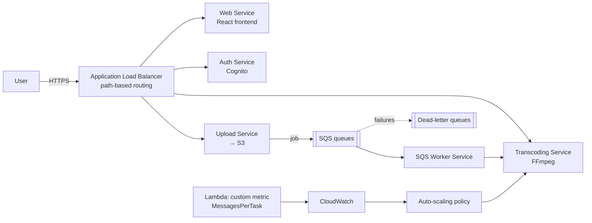

# Cloud Video Transcoding Platform (AWS Microservices)

> A cloud-native video-transcoding platform: **5 microservices on AWS ECS Fargate**, queue-driven **custom-metric autoscaling**, dead-letter queues for resilience, and **fully reproducible infrastructure in Terraform**.

## Overview

Users upload a video; the platform transcodes it with **FFmpeg** as a CPU-intensive background job, scaling worker capacity up and down automatically with demand. It was designed to satisfy a full cloud-architecture rubric — microservices, load distribution, autoscaling, HTTPS, and infrastructure-as-code — and demonstrates a clean 1 → 5 → 1 scaling cycle under load.

## Architecture

## Key engineering decisions

- **Microservices on ECS Fargate** — auth, upload, transcoding, SQS worker and web are separate services, each independently deployable and scalable.
- **Custom autoscaling metric** — a Lambda function (run every minute via EventBridge) computes **`MessagesPerTask` = queue depth ÷ running tasks** and publishes it to CloudWatch. The transcoding service scales on *actual backlog*, not just CPU — so it reacts to real workload. Demonstrated scaling **1 → 3/5 tasks** under load and back to 1 when idle.
- **Asynchronous load distribution** — SQS queues decouple upload from transcoding; an ALB does path-based routing (`/api/auth/*`, `/api/transcoding/*`, …) to the right service.
- **Resilience** — every main queue has a **dead-letter queue** with a redrive policy (3 attempts, 14-day retention) so failed jobs are isolated for analysis instead of lost.
- **Security** — end-to-end HTTPS with an ACM certificate and a custom domain; SSL termination at the ALB with HTTP→HTTPS redirect.
- **Infrastructure as Code** — the entire stack (ECS, ALB + target groups, SQS + DLQs, Lambda, EventBridge, autoscaling, CloudFront, security groups/VPC) is defined in **Terraform** and reproducible from scratch.
- **Orchestration extras** — scheduled maintenance/log-cleanup tasks and rolling deployments with a circuit breaker + auto-rollback for zero-downtime releases.

## Skills demonstrated

Cloud architecture on AWS · microservices & container orchestration (ECS Fargate) · event-driven design (SQS/Lambda/EventBridge) · autoscaling strategy beyond CPU · Terraform IaC · resilience patterns (DLQ, circuit breaker) · HTTPS/TLS.

---

*Developed for the Cloud Computing unit, Master of Data Analytics, QUT. This is a case-study write-up — it contains no account IDs, ARNs or credentials, and does not redistribute the deployment.*
